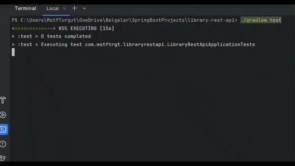

# Library REST API

This Spring Boot project delivers a library API with robust authentication and authorization features, enabling secure access for both students and library managers.  

 

## Test Driven Development

Throughout the development process of this project, I carefully adhered to Test-Driven Development (TDD) principles, ensuring comprehensive testing at every stage of development for enhanced reliability and code quality. 

 

 
 

Mustafa Turgut  
mstftrgt00@gmail.com

